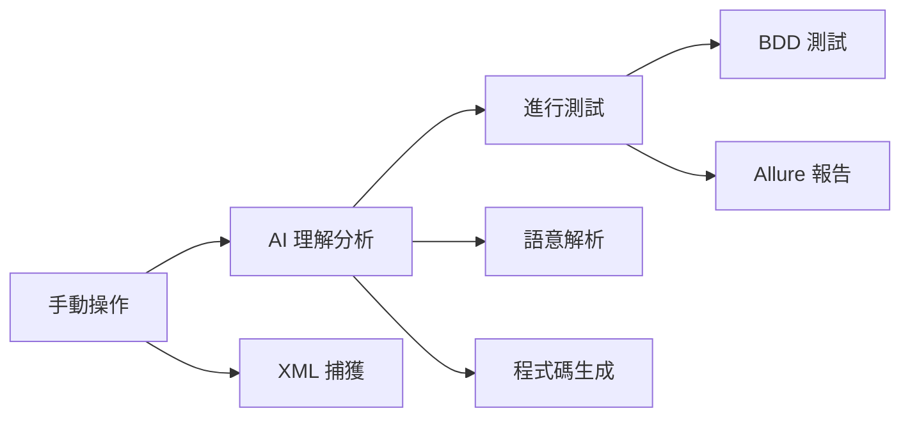

**Slide 1: 標題頁**

* **標題:** AI 驅動的 iOS UI 測試自動化框架

* **副標題:** 從手動操作到 BDD 測試報告的零代碼自動生成

* **報告者/團隊:** [您的姓名/團隊名稱]

* **日期:** [報告日期]

---

**Slide 2: 議程 (Agenda)**

1. **現狀挑戰** - 手動 UI 測試的困境

2. **創新解決方案** - xml_to_UITest_project 專案介紹

3. **技術架構剖析** - AI-First 設計理念

4. **實際演示** - Live Demo

5. **成果與效益** - 量化價值展現

6. **未來展望** - 下一階段發展

7. **Q&A**

---

**Slide 3: 現況與挑戰：手動 UI 測試的困境**

手動測試 VS 自動化測試（Appium）

* 時間成本、維護負擔、技術門檻、一致性

---

**Slide 4: Appium 運行架構**

圖

- **Appium Server** → **Appium-XCUITest-Driver** → **WDA** → **iOS 設備**

---

**Slide 6: 架構設計**

#### 🔧 **工程化最佳實踐**

```
xml_to_UITest_project/
├── main.py                # 簡潔命令入口
├── run_tests.py           # 一鍵執行引擎  
├── src/
│   ├── prompts/           # AI 提示模板庫 ⭐
│   ├── capture_xml.py     # 智能捕獲引擎
│   ├── generate_tests.py  # AI 程式碼生成 ⭐
│   └── config.py          # 統一配置管理
└── data/                  # 清晰數據管道
    ├── raw_xmls/          # 原始捕獲
    ├── cleaned_mds/       # AI 輸入準備
    ├── features/          # BDD 測試套件
    ├── pages/             # Page Object 庫
    └── allure-report/     # 最終報告
```

- **前置處理**
  - XML原始資料
  - 清洗後markdown
- **運行實踐**
  - Gherkin特徵檔 (feature)
  - 步驟定義(steps)
  - Page Object Model
  - 其他：
    - 環境設定（Behave, 手機裝置）
    - 測試資料
    - Prompt檔

---

**Slide 4: Appium Clients 具體實現：`xml_to_UITest_project`**

* #### 🎯 **專案願景**

  > **"讓 AI 成為您的測試工程師"**
  > 將繁瑣的手動操作流程，一鍵轉換為 BDD 測試專案

  #### 📦 **核心產出**

  ```
  🔄 標準化 Page Object Model   → 可維護的程式架構
  📝 人類可讀的 Gherkin 測試案例  → 業務邏輯清晰表達  
  ⚙️ 可立即執行的步驟定義         → 直接運行
  📊 互動式 Allure 測試報告   		→ 結果展示
  ```

  #### ⭐ **目標**

  - **Zero-Code**: 無需編寫任何測試程式碼
  - **AI-First**: 深度語意理解，非簡單模板生成

---

**Slide 5: AI-First 設計哲學**

#### 🏗️ **三階段智能工作流**(捕獲、AI生成、執行與報告)

mermaid



#### 🧠 **核心技術**

- **AI 引擎**: GPT-4o (  AI 提示工程 : 語意理解 + 程式碼生成)
- **自動化框架**: Appium + XCUITest
- **測試框架**: Behave (BDD)
- **報告系統**: Allure Report
- **語言**: Python (功能實踐)

**🔴 三階段**

- **階段一: 捕獲**
  - 即時 XML 捕獲
  - XML 清洗後的 Markdown
  - 解析並歸納檔案 
- **階段二: AI 生成**
  - AI 解析並生成程式碼預覽
- **階段三: 執行與報告**
  - 執行自動化測試
  - Allure 報告自動生成

---

**Slide 7: 實際演示 - Live Demo**

---

**Slide 8: 回報效益**

- **開發效率**: 測試開發時間縮短
- **人力成本**: 減少專職測試工程師需求
- **程式碼品質**：標準化程式碼生成
- **風險控制**: 自動化回歸測試，降低發版風險

---

**Slide 9: 風險評估**

- **成本風險**: API 調用費用
- **品質風險**: AI 生成品質穩定性

---

**Slide 10: 未來思考**

- AI 生成品質如何保證？多層驗證 + 人工審核機制
- 與現有測試體系如何整合？
- 成本效益具體如何計算？
- 技術團隊學習成本如何？