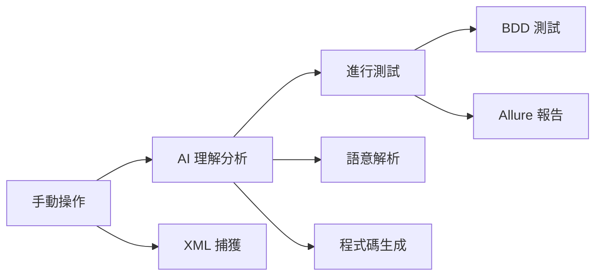

**Slide 1: 標題頁**

* **標題:** AI 驅動的 iOS UI 測試自動化框架

* **副標題:** 從手動操作到 BDD 測試報告的零代碼自動生成

* **報告者/團隊:** [您的姓名/團隊名稱]

* **日期:** [報告日期]

---

**Slide 2: 議程 (Agenda)**

1. **現狀挑戰** - 手動 UI 測試的困境

2. **創新解決方案** - xml_to_UITest_project 專案介紹

3. **技術架構剖析** - AI-First 設計理念

4. **實際演示** - Live Demo

5. **成果與效益** - 量化價值展現

6. **未來展望** - 下一階段發展

7. **Q&A**

---

**Slide 3: 背景與挑戰：手動 UI 測試的困境**

* 手動測試 VS 自動化測試
  * 時間成本、維護負擔、技術門檻、一致性


---

**Slide 4: 我們的解決方案：`xml_to_UITest_project`**

* #### 🎯 **專案願景**

  > **"讓 AI 成為您的測試工程師"**
  > 將繁瑣的手動操作流程，一鍵轉換為 BDD 測試專案

  #### 📦 **核心產出 (四位一體)**

  ```
  🔄 標準化 Page Object Model   → 可維護的程式架構
  📝 人類可讀的 Gherkin 測試案例  → 業務邏輯清晰表達  
  ⚙️ 可立即執行的步驟定義         → 直接運行
  📊 互動式 Allure 測試報告   		→ 結果展示
  ```

  #### ⭐ **獨特賣點**

  - **Zero-Code**: 無需編寫任何測試程式碼
  - **AI-First**: 深度語意理解，非簡單模板生成


---

### **Slide 5: 技術架構 - AI-First 設計哲學**

#### 🏗️ **三階段智能工作流**(捕獲、AI生成、執行與報告)

mermaid



#### 🧠 **核心技術**

- **AI 引擎**: GPT-4o (  AI 提示工程 : 語意理解 + 程式碼生成)
- **自動化框架**: Appium + XCUITest
- **測試框架**: Behave (BDD)
- **報告系統**: Allure Report
- **語言**: Python (功能實踐)

------

### **Slide 6: 實際演示 - Live Demo

#### 🎬 **演示腳本** (7 分鐘)

1. **階段一: 捕獲** (2 分鐘)

   bash

   ```bash
   python main.py capture
   ```

   - 展示手動操作 iOS App
   - 即時顯示 XML 捕獲過程
   - 展示清洗後的 Markdown 品質

2. **階段二: AI 生成** (2 分鐘)

   bash

   ```bash
   python main.py generate --matched_folder ios_demo_flow
   ```

   - 展示 AI 分析過程
   - 即時生成的程式碼預覽
   - 強調生成速度 (分鐘級別)

3. **階段三: 執行與報告** (3 分鐘)

   bash

   ```bash
   python run_tests.py
   ```

   - 自動化測試執行
   - Allure 報告自動生成
   - 互動式結果展示

#### 📋 **準備清單**

-  簡化版演示 App
-  預先準備的失敗案例 (展示報告功能)
-  網路備案 (預錄影片)

------

### **❌ Slide 7: 競品對比分析** 

#### 📊 **市場定位圖**

```
解決方案開發效率維護成本AI 智能企業適用性
我們的方案⭐⭐⭐⭐⭐⭐⭐⭐⭐⭐⭐⭐⭐⭐⭐⭐⭐⭐⭐⭐
Appium Studio⭐⭐⭐⭐⭐⭐⭐⭐⭐
Testim/Mabl⭐⭐⭐⭐⭐⭐⭐⭐⭐⭐⭐⭐⭐
傳統手寫⭐⭐⭐⭐⭐⭐⭐⭐
```

#### 🎯 **差異化優勢**

- **語意理解**: 真正理解 UI 意圖，而非死板錄製
- **自適應生成**: 根據實際 App 結構動態調整
- **零學習成本**: 業務人員也能輕鬆使用

------

### **❌ Slide 8: 量化成果與 ROI 分析**

#### 📈 **效率革命數據**

```
開發時間:     5-7 天  →  15-30 分鐘     (效率提升 95%+)
測試覆蓋:     人工抽樣  →  全流程自動化   (覆蓋率 100%)
維護成本:     每次重寫  →  智能適配      (維護成本 -80%)
人力需求:     專業工程師  →  業務人員     (門檻降低 90%)
API 成本:     優化前後  →  單次調用      (成本優化 60%+)
```

#### 💰 **ROI 計算 (以中型團隊為例)**

- **傳統方式成本**: 測試工程師月薪 8萬 × 6個月 = 48萬
- **我們的方案成本**: AI API費用 + 工具維護 = 5萬/年
- **年度節省**: 43萬元 (ROI: 860%)

#### 🎯 **質量提升指標**

- **程式碼標準化**: 100% 符合 POM 設計模式
- **測試可讀性**: Gherkin 格式，業務人員可直接理解
- **報告專業度**: Allure 互動報告，媲美企業級工具

------

### **❌Slide 9: 成功案例展示**

#### 🏆 **專案實施成果**

- **目標 App**: 新光銀行 iOS App
- **測試範圍**: 登入流程 + 台幣轉帳完整業務流程
- **生成結果**:
  - 15+ Page Objects
  - 30+ 測試步驟定義
  - 5+ 完整 Feature 檔案
  - 專業級 Allure 報告

#### 📊 **關鍵指標達成**

- ✅ 零程式碼編寫
- ✅ 一鍵執行成功
- ✅ 報告自動生成
- ✅ CI/CD 整合就緒

------

### **❌Slide 10: 技術創新亮點**

#### 🚀 **核心創新點**

1. **提示工程外部化**

   ```
   src/prompts/
   ├── name_pages.txt
   ├── generate_page_object.txt  
   ├── generate_steps.txt
   └── generate_feature.txt
   ```

   - 非開發人員也能優化 AI 行為
   - 快速適應新業務需求

2. **智能重試機制**

   - 指數退避策略
   - API 成本自動優化
   - 網路異常自動恢復

3. **多維度驗證**

   - 語法檢查 (compile)
   - 格式驗證 (JSON)
   - 邏輯一致性檢查

------

### **Slide 11: 架構設計優勢**

#### 🔧 **工程化最佳實踐**

```
xml_to_UITest_project/
├── main.py                # 簡潔命令入口
├── run_tests.py           # 一鍵執行引擎  
├── src/
│   ├── prompts/           # AI 提示模板庫 ⭐
│   ├── capture_xml.py     # 智能捕獲引擎
│   ├── generate_tests.py  # AI 程式碼生成 ⭐
│   └── config.py          # 統一配置管理
└── data/                  # 清晰數據管道
    ├── raw_xmls/          # 原始捕獲
    ├── cleaned_mds/       # AI 輸入準備
    ├── features/          # BDD 測試套件
    ├── pages/             # Page Object 庫
    └── allure-report/     # 最終報告
```

#### ⚡ **可擴展性設計**

- **配置驅動**: 新 App 只需修改 config.py
- **模板化**: 新測試類型只需新增 prompt 模板
- **插件架構**: 支援 Android、Web 平台擴展

------

### **Slide 12: 未來發展路線圖**

#### 🛣️ **短期目標 (3-6 個月)**

- **✅ iOS 平台完善** (已完成)
- **🔄 Android 平台支援** (開發中)
- **🔧 CI/CD 深度整合** (規劃中)

#### 🌟 **中期規劃 (6-12 個月)**

- **🎯 視覺迴歸測試**: AI 驅動的圖像對比
- **🧠 智能測試策略**: AI 自主規劃複雜測試路徑
- **☁️ 雲端部署方案**: Docker + Kubernetes

#### 🚀 **長期願景 (12+ 個月)**

- **🌐 跨平台統一**: iOS + Android + Web 一體化
- **🤖 自修復測試**: AI 自動修復失效測試案例
- **📊 測試智能分析**: 預測性品質分析

------

### **Slide 13: 投資回報與商業價值**

#### 💎 **直接效益**

- **開發效率**: 測試開發時間縮短 95%
- **人力成本**: 減少專職測試工程師需求
- **品質保證**: 100% 標準化程式碼生成
- **響應速度**: 分鐘級別適應業務變化

#### 🎯 **間接價值**

- **團隊協作**: 業務與技術團隊共同語言 (Gherkin)
- **知識傳承**: 測試流程文檔化、標準化
- **風險控制**: 自動化回歸測試，降低發版風險
- **創新推動**: 團隊專注核心業務創新

------

### **Slide 14: 風險評估與應對策略**

#### ⚠️ **潛在風險與對策**

```
風險類型風險描述應對策略
技術風險AI API 穩定性多供應商備案 + 本地化方案
成本風險API 調用費用智能快取 + 批次優化
品質風險AI 生成品質多層驗證 + 人工審核機制
依賴風險外部服務依賴離線模式 + 傳統方案並行
```

#### 🛡️ **品質保證機制**

- **自動驗證**: 語法 + 邏輯 + 執行三重檢查
- **版本控制**: 所有生成結果版本化管理
- **回滾機制**: 問題版本快速回退
- **監控告警**: 異常情況即時通知

------

### **Slide 15: 行動號召**

#### 🎯 **立即行動建議**

1. **Phase 1 - 試點驗證** (1-2 週)
   - 選擇 1-2 個核心業務流程
   - 完整流程端到端驗證
   - 效果評估與調優
2. **Phase 2 - 規模化部署** (1-2 個月)
   - 覆蓋主要業務流程
   - 團隊培訓與標準化
   - CI/CD 流程整合
3. **Phase 3 - 持續優化** (持續)
   - AI 提示詞持續優化
   - 擴展到其他平台
   - 內部最佳實踐沉澱

#### 🤝 **合作方式**

- **技術指導**: 完整的實施指導與培訓
- **定制開發**: 針對特殊需求的客製化功能
- **持續支援**: 長期技術支援與版本升級

------

### **Slide 16: Q&A 互動**

- **標題**: 問題與討論
- **準備常見問題**:
  - AI 生成品質如何保證？
  - 與現有測試體系如何整合？
  - 成本效益具體如何計算？
  - 技術團隊學習成本如何？

---